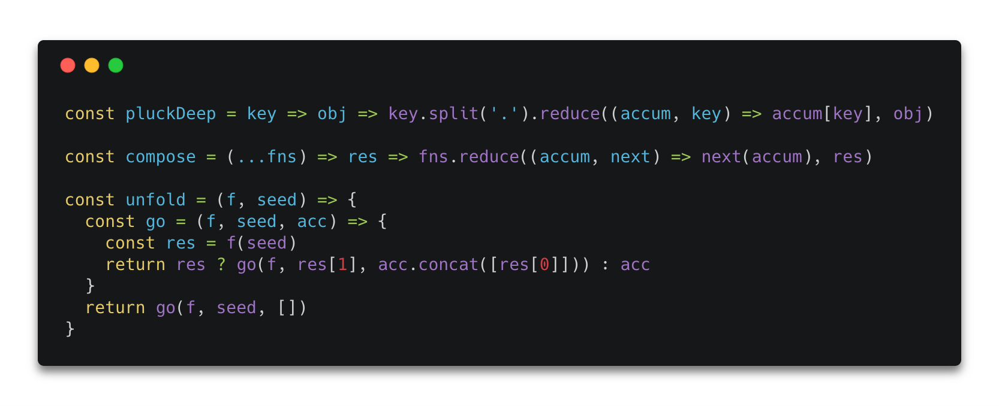
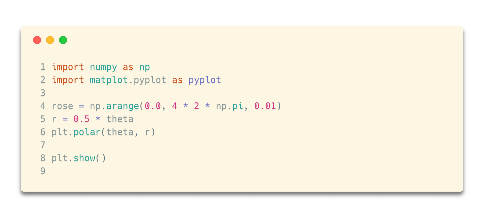

# LTするならCarbon使ってコードをオシャレに見せようぜ！

## かっこよくコードを見せたい！！

LTする機会があったのでコードをどうシート内で見せるか。
シンタックスハイライト自分で色変えてくのも手間だし。。。

と、そんなときにかっこよくコードを画像にできるサービスがあったので紹介。
ちなみにこんなかんじ！！

carbonというサービス!!
https://carbon.now.sh
>Create and share beautiful images of your source code.
>Start typing or drop a file into the text area to get started.

>あなたのコードを美しい画像でシェアしましょう！
>タイピングしたり、ファイルをテキストエリアにドロップしたりしてはじめてね！

とのこと。

# 設定できること

* デザインテーマ選択
* 言語ごとのシンタックスハイライト。ほとんどの言語対応できる。
* ドロップシャドウの有無。また影のつけ方。
* paddingの設定
* 角丸ありかなしか。
* 左上のコントローラーの有無、デザイン設定
* フォント、フォントサイズ選択
* 行数表示

とにかく自由！！こんな感じにもできるよ！！

PythonのコードでテーマをSolarized(Light)に
そいで行数表示してみた。

いいねー！　　
ただ画像だからコピペできない故、ブログとかには向かないかもだけど、
プレゼンとかSNS用だったら、かっこよくできる。

