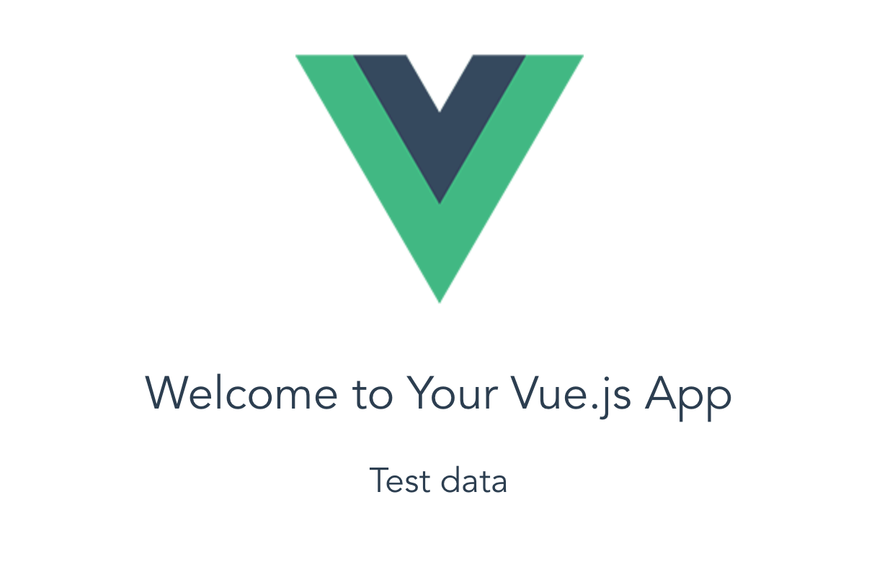

# VueCLIからVue.js入門 ②【トグル機能作成からVue.jsの基本的な機能を掴む】


前回：[VueCLIからVue.js入門①【VueCLIで出てくるファイルを概要図で理解】 - Qiita](https://qiita.com/po3rin/items/3968f825f3c86f9c4e21)

さて前回Vueアプリケーションの雛形が出来ました。今回はトグル機能作成を通してVue.jsの基本的な機能をつかみます。こういう入門は基本Todoとか作るんですけど、今回はVue.jsの機能だけに集中したいので、実装は簡単だけどVue.jsの基本に触れるトグルをチョイスしました。

まずは準備、 HelloWorld.vueのいらない部分を削除します。

```vue:HelloWorld.vue
<template>
  <div class="hello">
    <h1>{{ msg }}</h1>
  </div>
</template>

<script>
export default {
  name: 'HelloWorld',
  data () {
    return {
      msg: 'Welcome to Your Vue.js App'
    }
  }
}
</script>

<style scoped>
h1, h2 {
  font-weight: normal;
}
</style>
```

こんな感じになってる。


さて、上のコードをベースにここからVue.jsの機能に焦点を当てながらトグルを作っていきます。
今回解説するのは下記。


# 条件付きレンダリングで遊ぶ

画面に要素を表示するかどうかを簡単に実装します。トグルのメインの部分ですね。
これを作るには主に二つのVue.jsの機能を使います。順番に見ていきましょう。

## dataメソッド

めっちゃ使う。まじで。HelloWorld.vueでいうと下記の部分。

```js:HelloWorld.vue
data () {
  return {
    msg: 'Welcome to Your Vue.js App'
  }
}
```

これは、dataで持っているmsgの値を{{ msg }}で表示しています。例えば、```'Welcome to Your Vue.js App'```を```'Hello Vue.js'```にするとテキストが変わる。試して見てください。

例えば下記の様すると

```vue:HelloWorld.vue
<template>
  <div class="hello">
    <h1>{{ msg }}</h1>
　　　　　　　　<h2>{{ text }}</h2> <!--追加!!!!!!!-->
  </div>
</template>

<script>
export default {
  name: 'HelloWorld',
  data () {
    return {
      msg: 'Welcome to Your Vue.js App',
      text: 'Test data' //追加!!!!!!!
    }
  }
}
</script>
```



'Test data'の文が入りました。dataの中で```<template>```内に渡したい値を定義して、{{　}}の中に入れて使います。dataでreturnしている値はデータバインディングされている為、データの値がjs等で書き換わったら自動的に画面の表示も変わります。便利なんです。もうjQueryの```.text()```とかいらない子です。

## v-showディレクティブ

さて要素を表示するかどうかを決める条件付きレンダリングです。
使用例をみていきましょう。

```vue:HelloWorld.vue
<template>
  <div class="hello">
    <h1>{{ msg }}</h1>
    <h2 v-show="showText">{{ text }}</h2> <!--編集!!!!!!-->
  </div>
</template>

<script>
export default {
  name: 'HelloWorld',
  data () {
    return {
      msg: 'Welcome to Your Vue.js App',
      text: 'Test data',
      showText: false  //追加!!!!!!
    }
  }
}
</script>
```
v-showディレクティブはタグの中にいれて書きます。上のコード内ではイコールで```showText```という変数をみてます。この変数の名前は任意ですが、これがfalseなら非表示、trueなら表示となります。

そいでこの```showText```はdataメソッドの中で定義されています。```showText: false```の部分ですね。今回showTextはfalseなので、さきほど追加した'Test data'は画面では見えなくなっています。確認してみてください。

###showText=true にして表示してみる

確認が終わったら、今度は```showText: false```を```showText: true```にしてみましょう。'Test data'が表示されているはずです。Vue.jsにおいては表示するかしないかをこのように判定します。似たディレクティブでv-if(かなり使う)というものもありますので、調べてみてください。もうjQueryの```.css({display: none})```とかいらない子です。

これでdataメソッドとv-showディレクティブを使って要素を表示、非表示にするすべを身につけました。ここからクリックなどのイベントで表示を切り替える方法を学びます。

# イベントハンドリングで遊ぶ
ボタンをクリックしたら表示、非表示が切り替わる仕組みを作りましょう。

## v-onディレクティブと、methodsオブジェクト

早速使用例から

```vue:HelloWorld.vue
<template>
  <div class="hello">
    <h1>{{ msg }}</h1>
    <h2 v-show="showText">{{ text }}</h2>
    <button v-on:click="toggle">toggle</button> <!--追加!!!!!!-->
  </div>
</template>

<script>
export default {
  name: 'HelloWorld',
  data () {
    return {
      msg: 'Welcome to Your Vue.js App',
      text: 'Test data',
      showText: false
    }
  },//こっから下追加！！！！！！！！
  methods: { 
    toggle: function () {
      this.showText = !this.showText
    }
  }
}
</script>
```
### v-on:
buttonタグに```v-on:click```というものがついてます。v-onでイベント発火時の JavaScript の実行が可能になります。clickしたら呼ばれる関数名を```toggle```にしてます。これは```methods```オブジェクトの中で定義されています。適用する処理をテンプレートに宣言的に記述する為、非常にコードが見やすくなります。jQueryのクリックイベントをどこに書いたとか探さなくなります。

### methods:
methodsオブジェクトの中に実行したい関数をガシガシ定義していきます。これをv-on:clickで読んだり、他の関数から叩いたりします。今回はshowTextのtrue/falseを入れ替えています。

### thisについて
ちなみにdata内で定義した値はthis.showTextのようにthisを使って参照していきます。なのでアロー関数とか使うとVueで期待するthisとズレてしまいます。公式でもアロー関数は使用すべきじゃないよって言ってた。


さて、上のコードを確認するとこんなかんじ

### showText = false


### showText = true


これで簡単なトグルが実装できました。簡単な実装でしたが、Vue.jsの機能の大雑把な入門ができました。dataの値をデータバインディングしている為、jQueryでDOM操作する必要がなくなります。これがVue.jsの力です。時間があればv-modelディレクティブや v-forディレクティブあたりを抑えておけばいい感じです。

次回はついにコンポーネント分割。そして親子コンポーネント間のデータ受け渡しです。

