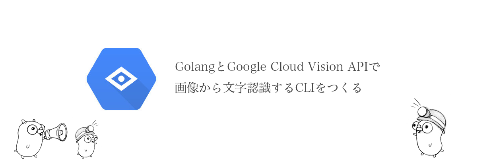

# GolangとGoogle Cloud Vision APIで画像から文字認識するCLIを速攻でつくる



普段、機械学習やらAIやらに縁のない僕ですが、WEBエンジニアとしては、現状のAPIがどこまで出来るのか知っておきたいと思い、Google Cloud Vision APIを試してみたので共有します。使う言語はGo言語です。画像のパスを指定するだけの超シンプルなCLIを作ります。

##そもそも Google Cloud Vision API って？
物体検知やテキスト抽出などがAPI経由で簡単に実行できるやつ。基本は画像認識はラベリングやら、学習データの設計やら、モデルを作ってなど工数かかるけど、その部分がGoogleがすでに用意した機械学習モデルを使って色々できますよってやつ。しかもAPIに画像投げるだけ。

公式の紹介ページ
>https://cloud.google.com/vision/

##前提
Go言語が使える環境が整っている
GCPにアカウント登録が完了している

##コマンドラインパラメータから画像のパスを受け取るようにする

まずコマンドラインパラメータは標準のosパッケージを使って持ってくる。
os.Argsでstringのスライスが帰ってくるのでこれをまずは標準出力してみる。

```go:main.go
package main

import (
	"fmt"
	"os"
)

func main() {
	path := os.Args[1]
	fmt.Println(path)
}
```

これで終わり、下記コマンドで確認してみる

```
$ go run main.go test.png
test.png
```

簡単ですね。あとはAPIにこのパスを渡すだけです。

## Vision APIを使う準備

APIを使う手順は公式を参考にしてみてください。
僕自身、初めてのGCPでしたがすぐに終わりました。AWSのドキュメントは毎日泣きながら読んでましたが、GCPのドキュメントはわかりやすくて良いですね。

>https://cloud.google.com/vision/docs/libraries#client-libraries-install-go

途中でプロジェクトの課金設定を有効にしますが、現時点では1000 API callまでは無料枠のよう。お試しならお金かからない。

環境変数 `GOOGLE_APPLICATION_CREDENTIALS`の設定も忘れずに！僕はGOPATHの設定にdirenvを使っていたのでそこに設定しました。

```bash
$ direnv edit .
export GOOGLE_APPLICATION_CREDENTIALS={キーが含まれる JSON ファイルのファイルパス}
```

direnvはGOPATHがらみでよく使うのでオススメ。プロジェクト毎に GOPATHがセットできる。direnvについては下記が参考になった
>http://tikasan.hatenablog.com/entry/2017/10/09/181333

## Vision APIの実装

完成形の全コードです。さっきの引数を新しく作った関数に渡します。公式ドキュメントとほぼそのままです。

```go:main.go
package main

import (
	"fmt"
	"log"
	"os"

	vision "cloud.google.com/go/vision/apiv1"
	"golang.org/x/net/context"
)

func main() {
	path := os.Args[1]
	ocr(path)
}

func ocr(filename string) {
	ctx := context.Background()

	client, err := vision.NewImageAnnotatorClient(ctx)
	if err != nil {
		log.Fatalf("Failed to create client: %v", err)
	}

	file, err := os.Open(filename)
	if err != nil {
		log.Fatalf("Failed to read file: %v", err)
	}
	defer file.Close()
	image, err := vision.NewImageFromReader(file)
	if err != nil {
		log.Fatalf("Failed to create image: %v", err)
	}

	texts, err := client.DetectTexts(ctx, image, nil, 10)
	if err != nil {
		log.Fatalf("Failed to detect labels: %v", err)
	}

	for _, text := range texts {
		fmt.Println(text.Description)
	}
}
```

ocr関数の一発目のcontextは、"golang.org/x/net/context"が提供しているパッケージ。APIのサーバーやクライアントを使うときに、コンテキストを提供してキャンセルや、タイムアウト、値を渡したり出来る仕組み。定義元を追いかけるとパッケージの中で渡したctxが使われている。


これで光学式文字認識（OCR）ができます。 試しにこの記事のヘッダー画像を引数に実行してみた

```bash
$ go run main.go go-vapi.png
Golang
と
Google
Cloud
Vision
API
で
画像
から
文字
認識する
CLI
を
つくる
```

一文字一句あってる且つ助詞や単語も区切れてる。最高かよ。ちなみに今回は扱いませんが手書き文字でもいけるみたい。

## APIの他の機能は？

client.DetectTexts()の部分ですが、ここを変えるだけで 返り値が変わります。

|機能のタイプ|説明|
|---|---|
|LABEL_DETECTION  |画像全体に対して画像コンテンツ分析を実行し、結果を返します。|
|TEXT_DETECTION|画像内のテキストに対して光学式文字認識（OCR）を実行します。|
|FACE_DETECTION|画像内の顔を検出します。|
|LANDMARK_DETECTION|画像内の地理的ランドマークを検出します。|
|LOGO_DETECTION|画像内の企業ロゴを検出します。|
|SAFE_SEARCH_DETECTION|画像の画像セーフサーチ プロパティを判別します。|
|IMAGE_PROPERTIES|画像の一連のプロパティ（画像のドミナント カラーなど）を計算します。|

実際に何個か試してみます。画像は同じものです。

###LABEL_DETECTION 

画像全体に対して画像コンテンツ分析を実行し、結果を返しますとのこと。

```go
texts, err := client.DetectLabels(ctx, image, nil, 10) // こちらに変更
```
```bash
$ go run main.go go-vapi.png
blue
text
font
product
product
logo
line
design
area
brand
```

###LOGO_DETECTION

画像内の企業ロゴを検出しますとのこと

```go
texts, err := client.DetectLabels(ctx, image, nil, 10) // こちらに変更
```
```bash
$ go run main.go go-vapi.png
Liteide
Go
```
我らがGopherくんからGoのロゴだと判断されている。
しかし、Vison API のロゴは無視された。まじか。

##まとめ
画像認識の知識うんこの僕でも実装できた！今後も機械学習モデル使ったAPIガンガン出てくると思うから、何がどの精度で出来るのかは追って行きたい。

