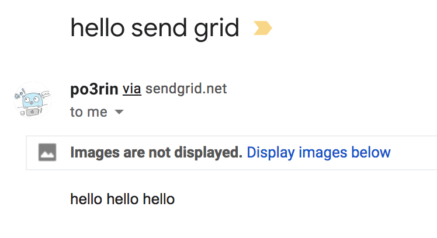

# Go言語 + SendGrid で「お問い合わせをメールで受信」を70行で実装する！


フリーの案件では「お問い合わせフォームが欲しい」という案件が多いですが、Go言語 + SendGrid してみたら、「お問い合わせをメールで受信」がGoのコード70行程で開発できて最高だったので、共有します。

今回の記事は公式のリポジトリをガッツリ参考にしてます。
https://github.com/sendgrid/sendgrid-go

## SendGrid とは


クラウドベースのmail送信サービス。メールサーバーの運用はめんどいので、それを全部お任せできる。WEB API とか SMTP APIで機能を組み込めるので実装も超簡単。通数上限も 12,000 通/月 なので軽いお問い合わせ程度のものなら毎月無料でも余裕で使えそう！今回はお問い合わせを受けるAPIサーバーを作ります。POSTで受け取ったデータを自分にメール送信します。

https://sendgrid.kke.co.jp/

## SendGrid の APIキーを所得する

まずは APIキーを所得する必要があります。
下のURLからアカウント登録をします。
https://sendgrid.kke.co.jp/

登録が完了したら、審査するっぽいので、メールが来るのを待ちます。僕の場合は3時間くらいで承認されました。

承認されたら、ログインしてAPIキーを所得します。
Settings > API Keys まで行って、Create API Key という青いボタンを押します、Permission を聞かれますが、一旦 Full Access で良いでしょう。

API Key を所得したら どこかに保存、もしくはコピーしておきます。API Key を紛失した場合、Key は二度と確認できないので Key の作り直しです。

## Go言語で実装

最終的にこうなります。

```
go-send-contact
├── domain
│   └── mail.go
├── handler
│   └── handler.go
├── main.go
└── sendgrid.env
```

まずはAPIキーを環境変数に入れておきましょう。YOUR_API_KEY のAPIキーを入れて実行します。念のため、外部に漏れないように .gitignore で環境変数を格納したファイルを指定しています。

```bash
$ echo "export SENDGRID_API_KEY={{YOUR_API_KEY}}" > sendgrid.env
$ echo "sendgrid.env" >> .gitignore
$ source ./sendgrid.env
```

では早速Go言語での実装にうつります。
domain/mail.go から作って行きます。送信するメールに必要なデータを構造体で定義ておきます。

```go
package domain

// Mail - strut mail
type Mail struct {
	Name    string `json:"name"`
	Subject string `json:"subject"`
	Text    string `json:"text"`
	Email   string `json:"email"`
}
```

続いて今回のメイン！受け取ったデータをmail送信します。まずはメール送信で使うパッケージを入れておきます。

"github.com/sendgrid/sendgrid-go" は API実装を 簡略化してくれているもので、"sendgrid-go/helpers/mail" は mailを作成するための helper です。

```bash
$ go get "github.com/sendgrid/sendgrid-go"
$ go get "github.com/sendgrid/sendgrid-go/helpers/mail"
```

```go
package handler

import (
	"go-send-contact/domain"
	"os"

	"github.com/gin-gonic/gin"

	sendgrid "github.com/sendgrid/sendgrid-go"
	"github.com/sendgrid/sendgrid-go/helpers/mail"
)

// SendMail - send mail include body data
func SendMail(c *gin.Context) {
	var m domain.Mail
    err := c.BindJSON(&m)
    if err != nil {
		c.JSON(http.InternalServerError, err.Error())
	}

	// set val to send mail
	from := mail.NewEmail(m.Name, m.Email)
	subject := m.Subject
	to := mail.NewEmail("admin", "example@email.com") // メールを受けたい名前とアドレスを指定
	plainTextContent := m.Text
	htmlContent := m.Text

	// create message
	message := mail.NewSingleEmail(from, subject, to, plainTextContent, htmlContent)

	// send mail
	client := sendgrid.NewSendClient(os.Getenv("SENDGRID_API_KEY"))
	response, err := client.Send(message)
	if err != nil {
		c.JSON(response.StatusCode, err.Error())
	}
	c.JSON(response.StatusCode, "success to send mail !!")
}
```

```c.BindJSON(&m)``` はPOSTで受け取った body を 構造体に bind します。
example@email.com の部分は、お問い合わせを受け取りたいメールアドレスを指定します。

ここまで来たらあとはrouterを走らせるだけです。```main.go```を作ります。

```go
package main

import (
	"go-send-contact/handler"

	"github.com/gin-gonic/gin"
)

func main() {
	r := gin.Default()
	r.POST("/api/v1/contact", handler.SendMail)
	r.Run()
}
```

これで POSTデータをmail送信するAPIが完成です。実行して動作を確認しましょう。

```bash
$ go run main.go
```

```bash
$ curl localhost:8080/api/v1/contact -d '{"name":"po3rin","subject":"hello send grid","text":"hello hello hello","email":"example@email.com"}'
"success to send mail !!"
```

example@email.com の部分は任意のメールアドレスに書き換えてください。
これで```"success to send mail !!"```が出ていれば動作しています。

mailが来ているか確認してみましょう。僕はGmialで受け取りました。




良いですね。これでお問い合わせをフロントエンドからPOSTで受け取って、そのままメールで受け取ることができるAPIができました。
SendGridはいろんな使い方ができるので、今後もいろいろ試していきます。

