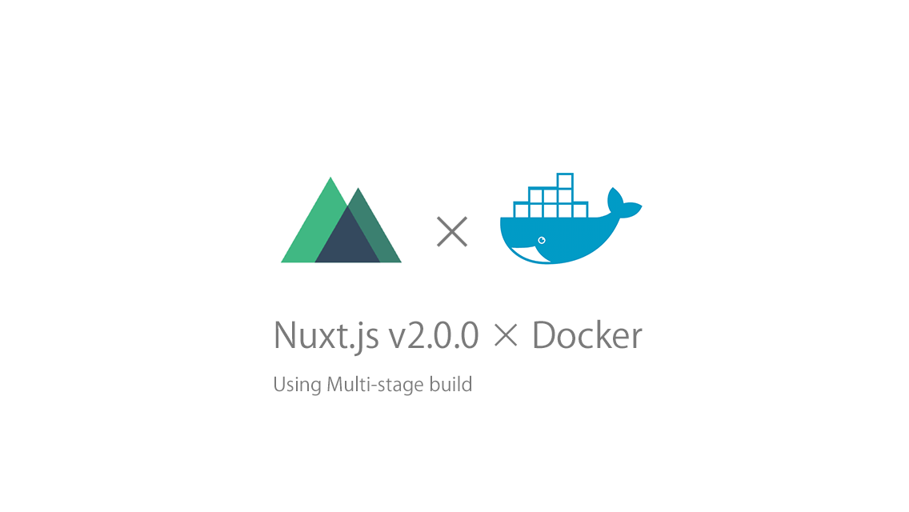

# Nuxt.js v2.0.0 を Docker Multi-stage build を使って Docker化 ハンズオン

Nuxt.js が v2.0.0 がリリースしました!
> Releases Nuxt.js v2.0.0
>https://github.com/nuxt/nuxt.js/releases/tag/v2.0.0

まだ全部のリリースは追えてませんが、プロジェクトの管理を更に楽にする機能が増えたという印象です。仕事で Nuxt.js はお世話になっているので随時追っていきます。せっかくなので今回は 新しく出た Nuxt.js v2.0.0 と Docker multi stage build を使って、軽量なイメージの作り方をハンズオン形式で紹介します。

## Nuxt.js v2.0.0 のプロジェクトを作る

まず、新しく出た Nuxt向けのコマンドラインツールである ```create-nuxt-app``` を使って Nuxt.js のプロジェクトを作ります。

```bash
$ yarn global add create-nuxt-app
$ create-nuxt-app try-nuxt2-docker #　try-nuxt2-docker は任意のプロジェクト名です
```

何個か質問されますが、僕は下記のように答えました。

```bash
? Project name try-nuxt2-docker
? Project description My top-notch Nuxt.js project
? Use a custom server framework koa　
? Use a custom UI framework none
? Choose rendering mode Universal
? Use axios module yes
? Use eslint yes
? Use prettier no
? Author name po3rin
? Choose a package manager yarn
```

```bash
$ cd try-nuxt2-docker
$ yarn dev
```

http://localhost:3000
にアクセスすると Nuxt.js のデフォの画面が見れます。
ここからこれを Docker化していきます。今後 3000番は使うので Ctrl + C でアプリケーションを停止しておきましょう。

## multi stage build で Nuxt.js を Docker化

multi stage build は アプリケーションを Build するイメージと、実行のイメージを分けることにより、実行用イメージには「実行に必要なものだけ」を入れて実行します。つまり、実行イメージを大幅に軽量化できるということに繋がります。それでは早速、Nuxt.js を　Docker化していきます。プロジェクトのルートに ```Dockerfile``` を作ります。


```Dockerfile
FROM node:10.11.0-alpine as builder

WORKDIR /app
ENV NODE_ENV=production

RUN  apk add --no-cache curl git && cd /tmp && \
    curl -#L https://github.com/tj/node-prune/releases/download/v1.0.1/node-prune_1.0.1_linux_amd64.tar.gz | tar -xvzf- && \
    mv -v node-prune /usr/local/bin && rm -rvf * && \
    echo "yarn cache clean && node-prune" > /usr/local/bin/node-clean && chmod +x /usr/local/bin/node-clean

ADD package.json ./
RUN yarn --frozen-lockfile --non-interactive && node-clean
ADD . ./
RUN yarn build


FROM node:10.11.0-alpine



WORKDIR /app
ENV HOST=0.0.0.0

ADD package.json ./
ADD nuxt.config.js ./

COPY --from=builder ./app/server ./server/
COPY --from=builder ./app/node_modules ./node_modules/
COPY --from=builder ./app/.nuxt ./.nuxt/
COPY --from=builder ./app/static ./static/

EXPOSE 3000
CMD ["yarn", "start"]
```

```FROM``` を境に Build用ステージと実行用ステージが分かれています。Buildステージで Nuxt.js を Buildして、本当に必要なものだけ　Buildステージからコピーしてきて、実行ステージで Run しているのが分かります。これを行うことで、本当に必要な実行イメージを軽量に保てます。

更に、上記のイメージでのポイントは Go言語で作られたコマンドラインツール ```node-prune``` で重くなりがちな ```node_modeles``` を軽量化しています。
> node-prune
> https://github.com/tj/node-prune

実務で使った際には 30MB ほど node_modelues を軽量化できました。ちなみに ```node-prune``` はソースコードの ```prune.go``` を読めば、どんなファイルを削ってくれるのかわかります。

> prune.go
> https://github.com/tj/node-prune/blob/master/prune.go

これで Dockerfile ができました！僕は環境変数の管理等がめんどいので、Dockerfile と同じ階層に ```docker-compose.yml``` を作って管理します。もちろん```docker run``` しても大丈夫です。

```yml
version: '3'

services:
  example:
    build: ./
    ports:
      - "3000:3000"
    restart: always
```

これで準備完了です。早速実行しましょう。

```bash
docker-compose up -d
```

http://localhost:3000
にアクセスすると、create-nuxt-app で指定した Node.js のフレームワークが Nuxt.js で作ったアプリケーションを返してくれます。

これで Docker + multi stage build を使って Nuxt.js を実行する コンテナが立ちました！

