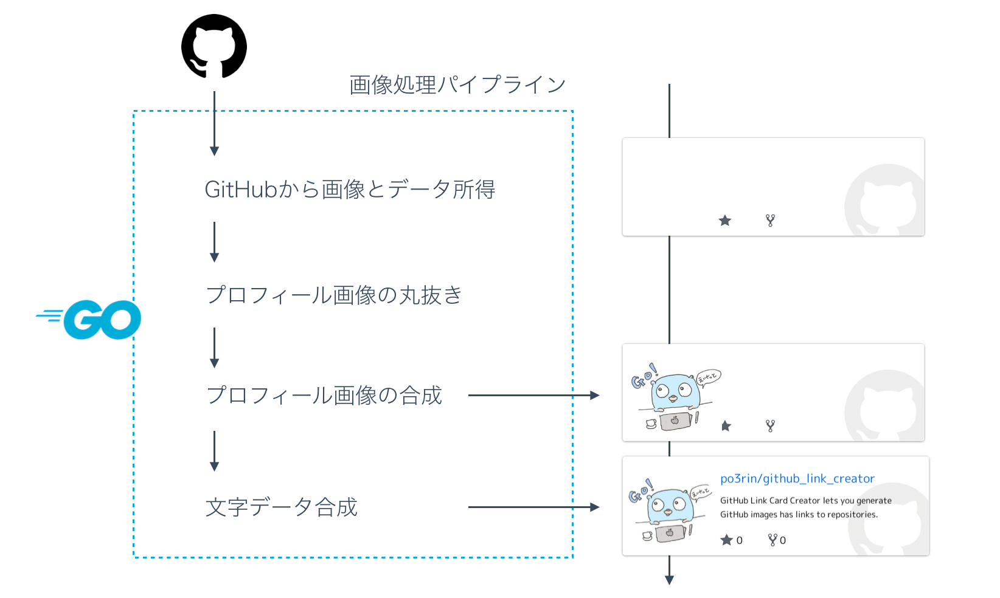
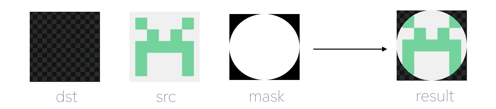
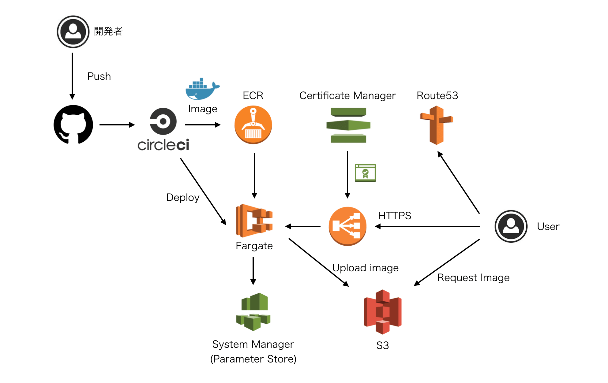

# みんなにOSSを見てもらいたい人の為に、GitHubリポジトリのOGP的画像を自動生成してくれるサービスを作った


こんにちはpo3rinです。GitHub リポジトリのOGP的画像を自動生成してくれるサービスを土日に作ったので紹介します。今まで Qiita等にリポジトリのURLを貼るだけで、クリックされずにスルーされがちだったリポジトリを救うサービスです。

## Github Link Card Creator

サイトはこちら!!

[GitHub Link Card Creator](https://ghlinkcard.com/)

何ができるか。。見てもらった方が早いでしょう。こんなのが作れます。

<a href="https://github.com/po3rin/github_link_creator"></a>

かっこよいい！

今まで Qiita にリポジトリのURLを貼るだけで、クリックされずにスルーされがちだったリポジトリも、このカードを使うと流入が期待できそうです。やることはただ ```<GitHub の user name>/<GitHub の リポジトリ名>``` を入力してエンターを押すだけです。サインインなども不要です。

注意としてはこのサイトで生成するコードは Qiita にペーストしても画像を読み込んでくれません。なので、画像だけ保存して、Qiitaにアップロードしてから URL を差し替えてください。(参考 :[issue#4](https://github.com/po3rin/github_link_creator/issues/4))

## CLI Mode

実は CLI としても機能を提供しています。インストールは下記のリポジトリのreleaseからbinaryをダウンロードしてください。

<a href="https://github.com/po3rin/github_link_creator"></a>

もし Go言語の環境があるなら下記コマンドでいけます。

```bash
go get github.com/po3rin/github_link_creator/cmd/repoimg
```

CLIをインストールできたら下記のコマンドで画像生成終了です。ローカルに画像ができます。

```
repoimg -n po3rin/github_link_creator
```

簡単!!!

一応 ```-o``` フラッグも提供していて、生成するファイル名を指定できます。

```
repoimg -n po3rin/github_link_creator -o example.png
```


## 技術的な話

画像処理周りは全てGo言語で作りました。フロントエンドはオーバーキル気味に Nuxt.js 使ってます。

Go言語では下記のような画像処理を行なっています。



一番苦労したのはプロフィール画像の丸抜きです。image/draw パッケージで作れるのですが、Go言語で画像を丸抜きする為には少なくとも3つのimageを準備する必要がありました。



```go
draw.DrawMask(dst, dst.Bounds(), src, image.ZP, mask, image.ZP, draw.Over)
```

上を使うと丸抜きできますが dst や mask の準備で結構コードが長くなるので、簡略化できるようにしたいと考え、画像をいい感じに丸抜きしてくれるパッケージを作りました。

<a href="https://github.com/po3rin/img2circle"></a>

これを使えばこうです！実質二行で丸抜き終了です。

```go
package main

import (
    _ "image/jpeg"
    "image/png"
    "os"

    "github.com/po3rin/img2circle"
)

func main(){
    img, _ := os.Open(*imgPath)
    defer img.Close()
    src, _, _ := image.Decode(img)

    // use img2circle packege.
    c, _ := img2circle.NewCropper(img2circle.Params{Src: src})
    result := c.CropCircle()

    file, _ := os.Create("cropped.png")
    defer file.Close()
    _ = png.Encode(file, result)
}
```

使えるパラメータがまだ少ないので、必要によって拡張していきたいです。

## インフラの話

AWS fargete に deploy しています。CircleCIによる CI/CD もやってます。簡略化して見るとこんな感じ



初めてFargate使いました。僕は Parametor store に GitHub の ClientID や ClientSecret を保存しています。上の図にはありませんがKMSでデータの暗号化をしています。

構成に関しては @hgsgtk さんの記事が大いに勉強になりました。
http://khigashigashi.hatenablog.com/entry/2018/08/28/214417

#### 追記
@hgsgtk さんにコメントで補足頂きました。Fargateでの環境変数設定に関する2019/2時点での情報はこちらをご覧下さい。非常に勉強になります！

https://devblog.thebase.in/entry/2019/01/16

## まとめ

今回は自分がブログなどを書いていて課題に感じていた点を解決するサービスだったので、モチベ的にも継続&集中できたので楽しかったです。自分の周りを少し改善するサービスであれば、小難しいことしなくてもサクッと作れるので、皆さんも一緒に個人開発していきましょう。

そして、まだ中のコードがボロボロなので少しづつ改良していきます。もちろん皆様のPRもお待ちしています！

<a href="https://github.com/po3rin/github_link_creator"></a>

