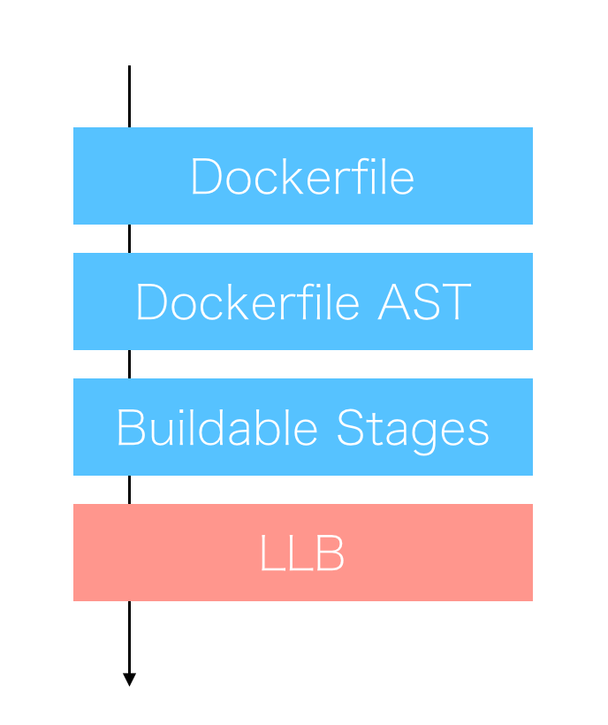

# Buildkit の Goのコードを読んで Dockerfile 抽象構文木から LLB を生成するフローを覗いてみよう！！


こんにちはpo3rinです。最近趣味でmoby project の buildkit の実装をぼーっと眺めてます。

前回の記事で Dockerfile の parser を使い、Dockerfie の抽象構文木の構造を確認しました。https://qiita.com/po3rin/items/a3934f47b5e390acfdfd

更に暇なので、Dockerfile の AST がどのように LLB に変換されているかを大雑把に探ったので記事にしました。執筆時 moby/buildkit のバージョンはv0.3.3です。

## LLBとは


Docker 18.09から BuildKit が正式に統合され、Dockerfileのビルドをローレベルの中間ビルドフォーマット（LLB：Low-Level intermediate build format）を介して行われるようになりました。LLBはDAG構造(上の画像のような非循環な構造)を取ることにより、ステージごとの依存を解決し、並列実行可能な形で記述可能です。これにより、BuildKitを使ったdocker build は並列実行を可能にし、従来よりもビルドを高速化しています。

参考：https://www.publickey1.jp/blog/18/docker_engine_1809buildkit9.html

## Parserがどこで使われているのか探す

まず、ASTの確認で使った ```moby/buildkit/frontend/dockerfile/parser/parser.go``` の ```parser.Parse``` 関数を呼び出している部分を検索してみましょう。そうすると下記がヒットします。

```
buildkit/frontend/dockerfile/parser/dumper/main.go
buildkit/frontend/dockerfile/instructions/parse_test.go
buildkit/frontend/dockerfile/instructions/parse_test.go
buildkit/frontend/dockerfile/dockerfile2llb/convert.go
```

この中で明らかにbuildkit/frontend/dockerfile/dockerfile2llb/convert.goだけが匂います。コードを見ると下記の関数が呼び出していました。

```go
func Dockerfile2LLB(ctx context.Context, dt []byte, opt ConvertOpt) (*llb.State, *Image, error){
    // ...
    dockerfile, err := parser.Parse(bytes.NewReader(dt))
	if err != nil {
		return nil, nil, err
    }
    // ...
}
```

Dockerfile から LLB(Low-Level intermediate build format) を生成するドンピシャの関数発見です。引数の dt は parser.Parse の引数に使うところから推察して Dockerfile のバイト列を渡しているのでしょう。opt は ConvertOpt という名前から LLB に Convert するときの Option を渡せるそうです。

## DockerfileのASTがLLBになるフローを読む

それでは前回確認した Dockerfile の AST が使われているコードをみてみましょう。dockerfile.AST をさらに Parse している箇所があります。

```go
func Dockerfile2LLB(ctx context.Context, dt []byte, opt ConvertOpt) (*llb.State, *Image, error){
    // ...
    stages, metaArgs, err := instructions.Parse(dockerfile.AST)
	if err != nil {
		return nil, nil, err
    }
    // ...
}
```

何やら AST から stages & metaArgs という物を手に入れています。これはなんでしょうか。ローカルで確認してみます。import で多分ハマるので moby/buildkit をクローンしてきて適当な場所にディレクトリを切るとすんなり行きます。

```go
package main

import (
	"os"

	"github.com/kr/pretty"
	"github.com/moby/buildkit/frontend/dockerfile/instructions"
	"github.com/moby/buildkit/frontend/dockerfile/parser"
)

func main() {
	f, _ := os.Open("./Dockerfile")
	r, _ := parser.Parse(f)

	stages, metaArgs, _ := instructions.Parse(r.AST)
	pretty.Print(stages)
	pretty.Print(metaArgs)
}
```

対象は下記のようなマルチステージビルドするDockerfileにしましょう。

```Dockerfile
FROM golang:1.11.1 as builder

WORKDIR /api
COPY . .
ENV GO111MODULE=on
RUN CGO_ENABLED=0 GOOS=linux go build -a -installsuffix cgo .

FROM alpine:latest

RUN apk --no-cache add ca-certificates
WORKDIR /app
COPY --from=builder /api .
CMD ["./server"]
```

実行するとstagesは下記の構造であることがわかります。

```go
[]instructions.Stage{
    {
        Name:     "builder",
        Commands: {
            &instructions.WorkdirCommand{
                withNameAndCode: instructions.withNameAndCode{
                    code:"WORKDIR /api",
                    name:"workdir"
                },
                Path:            "/api",
            },
            &instructions.CopyCommand{
                withNameAndCode: instructions.withNameAndCode{
                    code:"COPY . .",
                    name:"copy"
                },
                SourcesAndDest:  {".", "."},
                From:            "",
                Chown:           "",
            },
            &instructions.EnvCommand{
                withNameAndCode: instructions.withNameAndCode{
                    code:"ENV GO111MODULE=on",
                    name:"env"
                },
                Env:             {
                    {Key:"GO111MODULE", Value:"on"},
                },
            },
            &instructions.RunCommand{
                withNameAndCode:       instructions.withNameAndCode{
                    code:"RUN CGO_ENABLED=0 GOOS=linux go build -a -installsuffix cgo .",
                    name:"run"
                },
                withExternalData:      instructions.withExternalData{},
                ShellDependantCmdLine: instructions.ShellDependantCmdLine{
                    CmdLine:      {"CGO_ENABLED=0 GOOS=linux go build -a -installsuffix cgo ."},
                    PrependShell: true,
                },
            },
        },
        BaseName:   "golang:1.11.1",
        SourceCode: "FROM golang:1.11.1 as builder",
        Platform:   "",
    },
    {
        Name:     "",
        Commands: {
            &instructions.RunCommand{
                withNameAndCode:       instructions.withNameAndCode{
                    code:"RUN apk --no-cache add ca-certificates",
                    name:"run"
                 },
                withExternalData:      instructions.withExternalData{},
                ShellDependantCmdLine: instructions.ShellDependantCmdLine{
                    CmdLine:      {"apk --no-cache add ca-certificates"},
                    PrependShell: true,
                },
            },
            &instructions.WorkdirCommand{
                withNameAndCode: instructions.withNameAndCode{
                    code:"WORKDIR /app",
                    name:"workdir"
                },
                Path:            "/app",
            },
            &instructions.CopyCommand{
                withNameAndCode: instructions.withNameAndCode{
                    code:"COPY --from=builder /api .",
                    name:"copy"
                },
                SourcesAndDest:  {"/api", "."},
                From:            "builder",
                Chown:           "",
            },
            &instructions.CmdCommand{
                withNameAndCode:       instructions.withNameAndCode{
                    code:"CMD [\"./server\"]",
                    name:"cmd"
                },
                ShellDependantCmdLine: instructions.ShellDependantCmdLine{
                    CmdLine:      {"./server"},
                    PrependShell: false,
                },
            },
        },
        BaseName:   "alpine:latest",
        SourceCode: "FROM alpine:latest",
        Platform:   "",
    },
}
```

何やら```instructions.Stage```構造体が出てきた。中身を見るとASTよりもさらに進んで、Dockerfileをビルド可能なステージの集まりに解析している。今回はマルチステージビルドを行うDockerfileなので```len(instructions.Stage)==2```であることがわかる。そして```instructions.Stage```の中ではコマンド種類ごとに解析されている。

では更に深ぼるために```instructions.Parser```のコードを読んでみよう。

```go
// Parse a Dockerfile into a collection of buildable stages.
// metaArgs is a collection of ARG instructions that occur before the first FROM.
func Parse(ast *parser.Node) (stages []Stage, metaArgs []ArgCommand, err error) {
	for _, n := range ast.Children {
		cmd, err := ParseInstruction(n)
		if err != nil {
			return nil, nil, &parseError{inner: err, node: n}
		}
		if len(stages) == 0 {
			// meta arg case
			if a, isArg := cmd.(*ArgCommand); isArg {
				metaArgs = append(metaArgs, *a)
				continue
			}
		}
		switch c := cmd.(type) {
		case *Stage:
			stages = append(stages, *c)
		case Command:
			stage, err := CurrentStage(stages)
			if err != nil {
				return nil, nil, err
			}
			stage.AddCommand(c)
		default:
			return nil, nil, errors.Errorf("%T is not a command type", cmd)
		}

	}
	return stages, metaArgs, nil
}
```

Children Nodeの数だけforで回している。そして、switch文でそのNodeがstageに関するものなのかcommandに関するものなのかを分けている。stageなら```[]instructions.Stage```に追加し、commandなら対象の```instructions.Stage```に追加している。

commandはそれぞれ意味ごとに```instructions.CmdCommand```や```instructions.CopyCommand```などに大別されている。Goを書いたことがある人ならば何やらinterfaceの香りがしてきますね。```buildkit/frontend/dockerfile/instructions/commands.go```を見るとやはりありました。

```go
// Command is implemented by every command present in a dockerfile
type Command interface {
	Name() string
}
```

これがCommandを表現するinterfaceですね。予想通りcommandの識別子を返します。識別子は```buildkit/frontend/dockerfile/command/command.go```にあります。つまりこれがDockerfileで使えるコマンドの全てです。

```go
// Define constants for the command strings
const (
	Add         = "add"
	Arg         = "arg"
	Cmd         = "cmd"
	Copy        = "copy"
	Entrypoint  = "entrypoint"
	Env         = "env"
	Expose      = "expose"
	From        = "from"
	Healthcheck = "healthcheck"
	Label       = "label"
	Maintainer  = "maintainer"
	Onbuild     = "onbuild"
	Run         = "run"
	Shell       = "shell"
	StopSignal  = "stopsignal"
	User        = "user"
	Volume      = "volume"
	Workdir     = "workdir"
)
```

switch文を見ると、defaultでエラーを返しています。つまり上のcommandに当てはまらないものに対してエラーを吐いています。ASTを作る時ではなくここで検知するんですね。

## LLBの中身を見る

```dockerfile2llb.Dockerfile2LLB``` のここから先は ```[]instructions.Stage``` からLLBを構築していく部分になります。dockerfile2llb.Dockerfile2LLB関数で最終的に出てくるLLBの出力をサラッと確認しましょう。

```go
package main

import (
	"io/ioutil"

	"github.com/kr/pretty"
	"github.com/moby/buildkit/client/llb/imagemetaresolver"
	"github.com/moby/buildkit/frontend/dockerfile/dockerfile2llb"
	"github.com/moby/buildkit/util/appcontext"
)

func main() {
	df, _ := ioutil.ReadFile("./Dockerfile")

	st, img, _ := dockerfile2llb.Dockerfile2LLB(appcontext.Context(), df, dockerfile2llb.ConvertOpt{})
	pretty.Print(st)
	pretty.Print(img)
}
```

出力が長いので、各自確認してみてください。st(llb.State型)はまさに欲していた LLB の定義を表し、img (dockerfile2llb.Image型) コンテナイメージの基本情報が入ります。

## まとめ

```dockerfile2llb.Dockerfile2LLB``` 関数が行なっていることを図にすると下記のようなフローになります。(ちょっとBuildable Stages から LLB までの詰めが甘いですが。。)




Goは読みやすくていいですね。実は README.md の moby/buildkit の buildctl コマンドを使った example でもLLBの構造を簡単に確認できます。暇ならそちらの紹介も記事にします。

