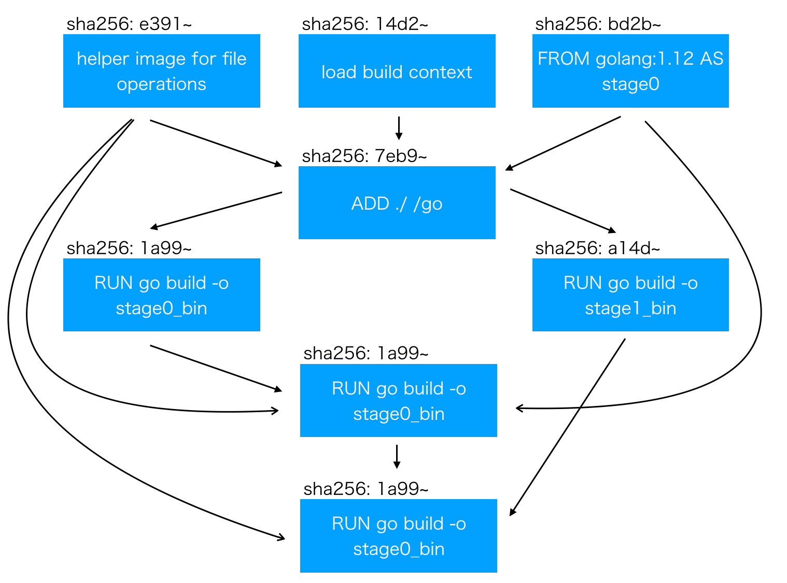

# Dockerに統合されたBuildKitのLLB (low-level builder)の仕様を探ってみよう

こんにちは。po3rin です。今回は前回の記事で解説し損ねた「そもそものLLBの中身はどうなってんねん」というところを解説します。

## そもそもLLBとは


BuildKit は、LLB というプロセスの依存関係グラフを定義するために使用されるバイナリ中間言語を利用して。イメージをビルドしています。

なぜこの中間言語を挟むかというと、LLB は DAG 構造(上の画像のような非循環構造)を取ることにより、ステージごとの依存を解決し、並列実行可能な形で記述可能だからです。これにより、BuildKit を使った docker build は並列実行を可能にしています。

[参考: Buildkit の Goのコードを読んで Dockerfile 抽象構文木から LLB を生成するフローを覗いてみよう！！
](https://qiita.com/po3rin/items/f414660bd2a6173c587a)

## LLB の構造を覗く

まずはLLBの中身を探るために簡単なDockerfileからLLBに変換します。ここではLLBの構造を見やくするために```buildctl```コマンドを使います。

### buildctl を使えるようにする
インストールはこちらを参考にしてみて下さい。

[参考: Docker に正式統合された BuildKit の buildctl コマンドの実行環境構築](https://qiita.com/po3rin/items/deb798ed9c1edac5cc4b#buildctl-%E3%81%AE%E7%92%B0%E5%A2%83%E6%A7%8B%E7%AF%89)

### buildctl でLLBを確認する

まずはDockerfileからLLBを生成して構造を目視で確認しましょう。まずは今回のターゲットになるDockerfileです。

```Dockerfile
FROM golang:1.12 AS stage0

ENV GO111MODULE on
WORKDIR /go

ADD ./po-go /go
RUN go build -o go_bin
```

そしてGo言語の環境で下記を実行します。Go言語が分からなくても安心してください。Dockerfileを読み込んでbuildkitが提供する関数でLLBに変換して、見やすい形で標準出力に出しているだけです。

```go
package main

import (
	"io/ioutil"
	"os"

	"github.com/moby/buildkit/client/llb"
	"github.com/moby/buildkit/frontend/dockerfile/dockerfile2llb"
	"github.com/moby/buildkit/util/appcontext"
)

func main() {
	df, _ := ioutil.ReadFile("./Dockerfile")

	st, _, _ := dockerfile2llb.Dockerfile2LLB(appcontext.Context(), df, dockerfile2llb.ConvertOpt{})

	def, _ := st.Marshal()
	llb.WriteTo(def, os.Stdout)
}
```

実行します。

```console
go run main.go | buildctl debug dump-llb | jq .
```

出力は長いので折り畳んでおきます。

<details><summary>LLBのJSON</summary><div>

```json
{
  "Op": {
    "Op": {
      "Source": {
        "identifier": "docker-image://docker.io/docker/dockerfile-copy:v0.1.9@sha256:e8f159d3f00786604b93c675ee2783f8dc194bb565e61ca5788f6a6e9d304061",
        "attrs": {
          "image.recordtype": "internal"
        }
      }
    },
    "platform": {
      "Architecture": "amd64",
      "OS": "darwin"
    },
    "constraints": {}
  },
  "Digest": "sha256:e391a01c9f93647605cf734a2b0b39f844328cc22c46bde7535cec559138357b",
  "OpMetadata": {
    "description": {
      "llb.customname": "[internal] helper image for file operations"
    },
    "caps": {
      "source.image": true
    }
  }
}
{
  "Op": {
    "Op": {
      "Source": {
        "identifier": "local://context",
        "attrs": {
          "local.followpaths": "[\"po-go\"]",
          "local.sharedkeyhint": "context",
          "local.unique": "0vlmkjq7ccgxx0c2pmhknu7gr"
        }
      }
    },
    "constraints": {}
  },
  "Digest": "sha256:a883cfd2f89c3fb66a76a7d88935d83686830c0c16b5e7dcdf35b93a94ac09aa",
  "OpMetadata": {
    "description": {
      "llb.customname": "[internal] load build context"
    },
    "caps": {
      "source.local": true,
      "source.local.followpaths": true,
      "source.local.sharedkeyhint": true,
      "source.local.unique": true
    }
  }
}
{
  "Op": {
    "Op": {
      "Source": {
        "identifier": "docker-image://docker.io/library/golang:1.12"
      }
    },
    "platform": {
      "Architecture": "amd64",
      "OS": "darwin"
    },
    "constraints": {}
  },
  "Digest": "sha256:bd2b1f44d969cd5ac71886b9f842f94969ba3b2db129c1fb1da0ec5e9ba30e67",
  "OpMetadata": {
    "description": {
      "com.docker.dockerfile.v1.command": "FROM golang:1.12",
      "llb.customname": "[1/3] FROM docker.io/library/golang:1.12"
    },
    "caps": {
      "source.image": true
    }
  }
}
{
  "Op": {
    "inputs": [
      {
        "digest": "sha256:e391a01c9f93647605cf734a2b0b39f844328cc22c46bde7535cec559138357b",
        "index": 0
      },
      {
        "digest": "sha256:bd2b1f44d969cd5ac71886b9f842f94969ba3b2db129c1fb1da0ec5e9ba30e67",
        "index": 0
      },
      {
        "digest": "sha256:a883cfd2f89c3fb66a76a7d88935d83686830c0c16b5e7dcdf35b93a94ac09aa",
        "index": 0
      }
    ],
    "Op": {
      "Exec": {
        "meta": {
          "args": [
            "copy",
            "--unpack",
            "/src-0/po-go",
            "go"
          ],
          "cwd": "/dest"
        },
        "mounts": [
          {
            "input": 0,
            "dest": "/",
            "output": -1,
            "readonly": true
          },
          {
            "input": 1,
            "dest": "/dest",
            "output": 0
          },
          {
            "input": 2,
            "selector": "./po-go",
            "dest": "/src-0/po-go",
            "output": -1,
            "readonly": true
          }
        ]
      }
    },
    "platform": {
      "Architecture": "amd64",
      "OS": "darwin"
    },
    "constraints": {}
  },
  "Digest": "sha256:980921cdf627d58bc3fe76e71cae9bb81d3aa769db0b4bbcc5095786e720906c",
  "OpMetadata": {
    "description": {
      "com.docker.dockerfile.v1.command": "ADD ./po-go /go",
      "llb.customname": "[2/3] ADD ./po-go /go"
    },
    "caps": {
      "exec.meta.base": true,
      "exec.mount.bind": true,
      "exec.mount.selector": true
    }
  }
}
{
  "Op": {
    "inputs": [
      {
        "digest": "sha256:980921cdf627d58bc3fe76e71cae9bb81d3aa769db0b4bbcc5095786e720906c",
        "index": 0
      }
    ],
    "Op": {
      "Exec": {
        "meta": {
          "args": [
            "/bin/sh",
            "-c",
            "go build -o go_bin"
          ],
          "env": [
            "PATH=/usr/local/sbin:/usr/local/bin:/usr/sbin:/usr/bin:/sbin:/bin",
            "GO111MODULE=on"
          ],
          "cwd": "/go"
        },
        "mounts": [
          {
            "input": 0,
            "dest": "/",
            "output": 0
          }
        ]
      }
    },
    "platform": {
      "Architecture": "amd64",
      "OS": "darwin"
    },
    "constraints": {}
  },
  "Digest": "sha256:8c78ad1616ec77e3c8d847abf071adf565058033586f5ddf78cb7d748059cb40",
  "OpMetadata": {
    "description": {
      "com.docker.dockerfile.v1.command": "RUN go build -o go_bin",
      "llb.customname": "[3/3] RUN go build -o go_bin"
    },
    "caps": {
      "exec.meta.base": true,
      "exec.mount.bind": true
    }
  }
}
{
  "Op": {
    "inputs": [
      {
        "digest": "sha256:8c78ad1616ec77e3c8d847abf071adf565058033586f5ddf78cb7d748059cb40",
        "index": 0
      }
    ],
    "Op": null
  },
  "Digest": "sha256:33db869df4ee6fae4e29c22dcf328725c6ca6d20470680be6c6b0adf7e14cf3e",
  "OpMetadata": {
    "caps": {
      "constraints": true,
      "meta.description": true,
      "platform": true
    }
  }
}
```

</div></details>

## LLBの中身をformat定義と比べながら見ていく

LLBの仕様はprotobufで定義されています。
https://github.com/moby/buildkit/blob/master/solver/pb/ops.proto

先ほど説明した通り、LLBは有向非循環グラフの構造をとります。すなわち、ここで定義されているのは主に各ノード(接点。頂点)のデータフォーマット(Op)とノードを枝(エッジ)を表現するータフォーマット(Definition)です。まず基本的なところから見ていきましょう。Opはグラフ構造のノードを表しています。

```protobuf
// Op represents a vertex of the LLB DAG.
message Op {
	// inputs is a set of input edges.
	repeated Input inputs = 1;
	oneof op {
		ExecOp exec = 2;
		SourceOp source = 3;
		CopyOp copy = 4;
		BuildOp build = 5;
	}
	Platform platform = 10;
	WorkerConstraints constraints = 11;
}
```

これは実際のLLBでは下の部分に対応します。```FROM golang:1.12```の一行がこのようにOpに変換されていることがわかります。

```json
{
  "Op": {
    "Op": {
      "Source": {
        "identifier": "docker-image://docker.io/library/golang:1.12"
      }
    },
    "platform": {
      "Architecture": "amd64",
      "OS": "darwin"
    },
    "constraints": {}
  },
  "Digest": "sha256:bd2b1f44d969cd5ac71886b9f842f94969ba3b2db129c1fb1da0ec5e9ba30e67",
  "OpMetadata": {
    "description": {
      "com.docker.dockerfile.v1.command": "FROM golang:1.12",
      "llb.customname": "[1/3] FROM docker.io/library/golang:1.12"
    },
    "caps": {
      "source.image": true
    }
  }
}
```

見るとわかる通り、Docker系の情報はOpMetadataの中にメタデータとして格納されるだけです。よってLLBがDockerfileの構造だけに依存している訳ではないことがわかります。

ここらでOpの種類を見てみましょう。Opの定義の```oneof op```を見るとわかる通り、実はOpの種類はわずかしかありません。例えばExecOpは下記の部分です。

```json
"Op": {
    "inputs": [
      // ...
    ],
    "Op": {
      "Exec": {
        "meta": {
          "args": [
            "/bin/sh",
            "-c",
            "go build -o go_bin"
          ],
          "env": [
            "PATH=/usr/local/sbin:/usr/local/bin:/usr/sbin:/usr/bin:/sbin:/bin",
            "GO111MODULE=on"
          ],
          "cwd": "/go"
        },
        "mounts": [
          {
            "input": 0,
            "dest": "/",
            "output": 0
          }
        ]
      }
    },
    "platform": {
      // ...
    },
    "constraints": {}
  },
  "Digest": "sha256:f2dd48bf7656705cfbefa478dca927bbe298d9adabd39576bfb7131ff57fd261",
  "OpMetadata": {
    // ...
  }
```

meta情報を見ると、argsにRUNで指定したコマンドが、cwdにWORKDIRの値が、envにENVで指定した環境変数がセットされています。実は、LLBの世界での環境変数ENVはExecOpだけに紐づいており、全てのOpに共通した設定というのができない構造になっています。

## LLBが有向非循環構造になっているのを確認する

さてLLBの構成因子Opを確認したところでこれらが有向非循環グラフになっていることを確認しましょう。ポイントはdigestです。もう一度LLBを見てみましょう。

```json
{
  "Op": {
    "Op": {
      // ...
  },
  "Digest": "sha256:b84b3a1967b1f5741f950a7b8b5d6145d791cccb414b0c044f19b432e306def5",
  "OpMetadata": {
    // ...
  }
}
```

Opには一つdigestがセットされています。一方でこのOpに依存するOpをみてみましょう.


```json
{
  "Op": {
    "inputs": [
      {
        "digest": "sha256:e391a01c9f93647605cf734a2b0b39f844328cc22c46bde7535cec559138357b",
        "index": 0
      },
      {
        "digest": "sha256:bd2b1f44d969cd5ac71886b9f842f94969ba3b2db129c1fb1da0ec5e9ba30e67",
        "index": 0
      },
      {
        "digest": "sha256:b84b3a1967b1f5741f950a7b8b5d6145d791cccb414b0c044f19b432e306def5",
        "index": 0
      }
    ],
    "Op": {
      // ...
    },
    "platform": {
      // ...
    },
    "constraints": {}
  },
  "Digest": "sha256:d9fce5f43b1af2d2b9192de6eae55a2ea79a190c058cb9cfddb1af3ffbdb21d2",
  "OpMetadata": {
    // ...
    }
  }
}
```

inputsとしてエッジで紐付くOpのdigestの値が記載されています。このようにしてLLBはDAG構造を表現しています。例えば。下記のようなDockerfileは

```Dockerfile
FROM golang:1.12 AS stage0
WORKDIR /go
ADD ./ /go
RUN go build -o stage0_bin

FROM golang:1.12 AS stage1
WORKDIR /go
ADD ./ /go
RUN go build -o stage1_bin

FROM golang:1.12
COPY --from=stage0 /go/stage0_bin /
COPY --from=stage1 /go/stage1_bin /
```

digest値を追っていくと下記のようなDAG構造を取っていることがわかります。



なぜLLBを挟むことで並列化を実現できるかが一目でわかりますね。

## まとめ

簡単にLLBの構造を追ってみて、なぜBuildKitでビルドの並列化ができるのかをみていきました。docker build の内部的な理解や、buildkikのコードリーディングをする際などに役立つはずです。

