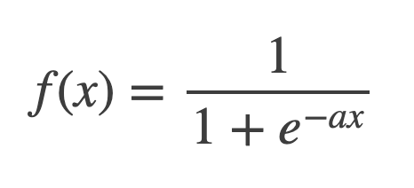

# Go + Gonum を使った行列計算まとめ


こんにちは！！Goを愛する皆様におかれましてはビッグデータ解析やニューラルネットワークの実装をGoでやりたいですよね！！そうすると嫌が応にも行列の計算が発生します。そこで今回は Go での行列計算をまとめました。

## gonum/mat

Go で 行列を扱う際には gonum パッケージが鉄板でしょう。gonum は行列だけでなく数値および科学的アルゴリズムの作成を支援するパッケージです。数値計算はこのパッケージに頼りましょう。

<a href="https://github.com/gonum/gonum"></a>

ちなみにこのリンク画像は自作サービスで自動生成しています。よかったら使ってみてください！
https://qiita.com/po3rin/items/eac851304cf058c532af

## 行列の基本

### 行列の作り方と内部構造を知る

まずは行列の作り方から

```go
package main

import (
	"fmt"

	"gonum.org/v1/gonum/mat"
)

func main() {
	x := []float64{1, 2, 3, 4, 5, 6, 7, 8, 9, 10, 11, 12}
    A := mat.NewDense(3, 4, x)
    // ⎡1  2  3  4⎤
    // ⎢5  6  7  8⎥
    // ⎣9 10 11 12⎦
}
```

```NewDense``` は ```*Dense``` を生成します。

```go
type Dense struct {
	mat blas64.General

	capRows, capCols int
}
```

```Dense``` の構造は ```NewDence``` の中身を見れば分かりやすいです。内部では単純に ```[]float64``` のデータや行数、列数、ストライドを保持しているだけです。

```go
func NewDense(r, c int, data []float64) *Dense {
	if r < 0 || c < 0 {
		panic("mat: negative dimension")
	}
	if data != nil && r*c != len(data) {
		panic(ErrShape)
    }
    // nil なら 0 で初期化される
	if data == nil {
		data = make([]float64, r*c)
	}
	return &Dense{
		mat: blas64.General{
			Rows:   r,
			Cols:   c,
			Stride: c,
			Data:   data,
		},
		capRows: r,
		capCols: c,
	}
}
```

```*Dense``` が ```Matrix``` インターフェースを実装しています。実装の中では基本的にこの ```Matrix``` 型で引き渡していくと便利です。

```go
// Matrix is the basic matrix interface type.
type Matrix interface {
	// Dims returns the dimensions of a Matrix.
	Dims() (r, c int)

	// At returns the value of a matrix element at row i, column j.
	// It will panic if i or j are out of bounds for the matrix.
	At(i, j int) float64

	// T returns the transpose of the Matrix. Whether T returns a copy of the
	// underlying data is implementation dependent.
	// This method may be implemented using the Transpose type, which
	// provides an implicit matrix transpose.
	T() Matrix
}
```

また、行列のデバッグのために整形して標準出力できるようにしておくと便利です。

```go
func matPrint(X mat.Matrix) {
	fa := mat.Formatted(X, mat.Prefix(""), mat.Squeeze())
	fmt.Printf("%v\n", fa)
}
```

これの関数を使えばフォーマットされた行列を出力できます。

```go
func main() {
	x := []float64{1, 2, 3, 4, 5, 6, 7, 8, 9, 10, 11, 12}
    A := mat.NewDense(3, 4, x)
    matPrint(A)
    // ⎡1   2   3   4⎤
    // ⎢5   6   7   8⎥
    // ⎣9  10  11  12⎦
}
```

```NewDense``` の内部実装をみた通り、全要素0で初期化したい場合は第３引数に ```nil``` を与えます。

```go
func main() {
    A := mat.NewDense(3, 4, nil)
    matPrint(A)
    // ⎡0  0  0  0⎤
    // ⎢0  0  0  0⎥
    // ⎣0  0  0  0⎦
}
```

以降 A を作るコードは基本的に省略します。

### 要素の変更 or 取得

これも簡単で ```At``` メソッドでアクセスできます。また新しい要素のセットは ```Set``` メソッドで行えます。

```go
func main() {
    // 行列作成は省略

    a := A.At(0, 2)
    println("A[0, 2]: ", a)
    // A[0, 2]:  +3.000000e+000

	A.Set(0, 2, -1.5)
    matPrint(A)
    // ⎡1   2  -1.5   4⎤
    // ⎢5   6     7   8⎥
    // ⎣9  10    11  12⎦
}
```

### 行だけ列だけを Vector として取り出す

```RowView``` と ```ColView``` で行列の中から指定した行 or 列を ```Vector``` として取得できます。取得している型は ```Vector``` インターフェースです。

```go
type Vector interface {
	Matrix
	AtVec(int) float64
	Len() int
}
```

```RowView``` と ```ColView``` の Example です。

```go
func main() {
    // 行列作成は省略

    matPrint(A.RowView(1))
    // ⎡5⎤
    // ⎢6⎥
    // ⎢7⎥
    // ⎣8⎦

    matPrint(A.ColView(0))
    // ⎡1⎤
    // ⎢5⎥
    // ⎣9⎦
}
```

### 指定した行や列を変更する

指定した行や列をまとめて更新できます。 ```SetRow```, ```SetCol``` で行ます。

```go
func main() {
    // 行列作成は省略

	row := []float64{10, 9, 8, 7}
    A.SetRow(0, row)
    matPrint(A)
    // ⎡10   9   8   7⎤
    // ⎢ 5   6   7   8⎥
    // ⎣ 9  10  11  12⎦

	col := []float64{3, 2, 1}
    A.SetCol(0, col)
    matPrint(A)
    // ⎡3   9   8   7⎤
    // ⎢2   6   7   8⎥
    // ⎣1  10  11  12⎦
}
```

### 要素同しの足し引き

ここは少し直感的ではないですが空の行列を作ってそこに計算結果を格納するという方法をとります。ゼロ値で初期化した ```mat.Dence``` に対して計算結果を込めます。計算結果を格納する先の行列のサイズが計算結果と合わないと ```panic``` するので注意してください。

```go
func main() {
    // 行列作成は省略

    B := mat.NewDense(3, 4, nil)
	B.Add(A, A)
    matPrint(B)
    // ⎡ 2   4   6   8⎤
    // ⎢10  12  14  16⎥
    // ⎣18  20  22  24⎦

	C := mat.NewDense(3, 4, nil)
	C.Sub(A, A)
    matPrint(C)
    // ⎡0  0  0  0⎤
    // ⎢0  0  0  0⎥
    // ⎣0  0  0  0⎦
}
```

毎回ゼロ値で初期化した ```mat.Dence``` を準備するのも面倒です。計算前の行列がいらないなら下記のようにも書けます。

```go
func main() {
    // 行列作成は省略

    A.Add(A, A)
	matPrint(A)

	A.Sub(A, A)
	matPrint(A)
}
```

ただ、いくらか関数の形が直感的ではないので独自の関数を用意しておくと便利かもしれません。

```go
func Add(a mat.Matrix, b mat.Matrix) mat.Matrix {
	var B mat.Dense
	B.Add(a, b)
	return &B
}
```

### 各要素の定数倍

各要素の定数倍も簡単です。 ```Scale``` メソッドを使います。

```go
func main() {
    // 行列作成は省略

    C = mat.NewDense(3, 4, nil)
	C.Scale(2, A)
    matPrint(C)
    // ⎡ 2   4   6   8⎤
    // ⎢10  12  14  16⎥
    // ⎣18  20  22  24⎦
}
```

### 転置行列

転置行列は ```T``` メソッドでいけます。

```go
func main() {
    // 行列作成は省略

    B := A.T()
    matPrint(B)
    // ⎡1  5   9⎤
    // ⎢2  6  10⎥
    // ⎢3  7  11⎥
    // ⎣4  8  12⎦
}
```

### 逆行列

逆行列は ```Inverse``` メソッドです。

```go
func main() {
    A = mat.NewDense(2, 2, []float64{3, 5, 1, 2})
    // ⎡3  5⎤
    // ⎣1  2⎦

    B = mat.NewDense(2, 2, nil)
    err := B.Inverse(A)
    if err != nil {
        log.Fatal("failed to create inverse matrix")
    }
    matPrint(B)
    // ⎡  1.999999999999999  -4.999999999999997⎤
    // ⎣-0.9999999999999996  2.9999999999999987⎦
}
```

概ね正しく計算できていますが、精度を要求されると厳しいかもしれません。

### 行列の内積

行列の内積は ```Product``` メソッドで行ます。(英語で内積は inner product )

```go
func main() {
    // 行列作成は省略

    C = mat.NewDense(3, 3, nil)
    C.Product(A, A.T())
    matPrint(C)
    // ⎡ 30   70  110⎤
    // ⎢ 70  174  278⎥
    // ⎣110  278  446⎦
}
```

当然、掛け合わせる行数と列数が同じではなければいけません。 ```dimension mismatch``` というパニックがおきますので注意してください。

### 要素ごとの乗算

内積ではなく、行列の要素ごとを乗算する要素積を計算するときは ```MulElem``` を使います。

```go
func main() {
    // 行列作成は省略

    C = mat.NewDense(3, 3, nil)
    C.MulElem(A, A)
    matPrint(C)
    // ⎡ 1    4    9   16⎤
    // ⎢25   36   49   64⎥
    // ⎣81  100  121  144⎦
}
```

### 行列のスライシング

スライシングは行列から指定の箇所を行列として抽出する操作です。

```go
func main() {
    // 行列作成は省略

    S := A.Slice(0, 3, 0, 3)
    matPrint(S)
    // ⎡1   2   3⎤
    // ⎢5   6   7⎥
    // ⎣9  10  11⎦
}
```

3 * 4 の行列から指定した0-3 * 0-3の部分だけを抽出しています。

### 行列の結合

行列の縦の結合は```Stack```、横の結合は```Augment```で行います。

```go
func main() {
	a := mat.NewDense(3, 2, []float64{
		1, 2,
		3, 4,
		5, 6,
	})
	b := mat.NewDense(3, 2, []float64{
		7, 8,
		9, 10,
		11, 12,
	})

	c := mat.NewDense(6, 2, nil)
	c.Stack(a, b)
	matPrint(c)
    /*
    ⎡ 1   2⎤
    ⎢ 3   4⎥
    ⎢ 5   6⎥
    ⎢ 7   8⎥
    ⎢ 9  10⎥
    ⎣11  12⎦
    */

	d := mat.NewDense(3, 4, nil)
	d.Augment(a, b)
	matPrint(d)
    /*
    ⎡1  2   7   8⎤
    ⎢3  4   9  10⎥
    ⎣5  6  11  12⎦
    */
}
```

### 各要素に任意の操作を実行する

```Apply``` を使います。第一引数にやりたい操作の関数を渡してあげるだけです。今回は例として要素の値に行番号、列番号を足す処理を定義しています。

```go
func main() {
    // 行列作成は省略

    // 要素ごとに適用する関数
    sumOfIndices := func(i, j int, v float64) float64 {
		return float64(i+j) + v
    }

	var B mat.Dense
	B.Apply(sumOfIndices, A)
    matPrint(B)
    // ⎡ 1   3   5   7⎤
    // ⎢ 6   8  10  12⎥
    // ⎣11  13  15  17⎦
```

これを使うと例えばシグモイド関数は下記のように書けますね！




```go

func Sigmoid(x mat.Matrix) mat.Matrix {
	sigmoid := func(i, j int, v float64) float64 {
		return 1 / (1 + math.Exp(-v))
	}
	var result *mat.Dense
	result.Apply(sigmoid, x)
	return result
}

```

## 行列のテスト

行列計算を実装したらテストを実装したいですよね！！ここでも gonum/mat パッケージが便利な関数を提供しています。一個前のコードで例としてあげたシグモイド関数をテストします。

```go
func TestSigmoid(t *testing.T) {
	tests := []struct {
		name  string
		input mat.Matrix
		want  mat.Matrix
	}{
		{
			name:  "2*2",
			input: mat.NewDense(2, 2, []float64{2, 2, 2, 2}),
			want:  mat.NewDense(2, 2, []float64{0.88079707797788, 0.88079707797788, 0.88079707797788, 0.88079707797788}),
		},
		{
			name:  "2*2 with 0",
			input: mat.NewDense(2, 2, []float64{0, 0, 0, 0}),
			want:  mat.NewDense(2, 2, []float64{0.5, 0.5, 0.5, 0.5}),
		},
	}

	for _, tt := range tests {
		tt := tt
		t.Run(tt.name, func(t *testing.T) {
			if got := Sigmoid(tt.input); !mat.EqualApprox(got, tt.want, 1e-14) {
				t.Fatalf("want = %d, got = %d", tt.want, got)
			}
		})
	}
}
```

ここで使うのは ```mat.EqualApprox``` 関数です。これは行列のサイズと値が等しいかをチェックします。第３引数は任意の許容誤差を指定できます。実際に１つ目のテストケースのwantは0.88079707797788と設定していますが、実際の計算結果の値は0.8807970779778823です。しかし、```mat.EqualApprox```に許容誤差を指定しているのでこのテストは通ります。

## 行列の内部実装をもっと！
最初に見た通り、Matrixインターフェースの実態として```Dense```があります。

```go
type Dense struct {
    mat blas64.General

    capRows, capCols int
}
```

```mat``` フィールドを見ると ```blas.General``` とあります。この ```blas``` とは何でしょうか。BLASとは、Basic Linear Algebra Subprogramsの略です。つまり基本的な線形演算のライブラリを意味しています。BLASには様々な種類があり OpenBLAS や ATLAS などが存在します。

各BLASの説明は下記の記事がまとまっている印象
https://echomist.com/python-blas-performance/

gonumでは使うBLASを切り替えれます。下記は gonum/blas/blas64/blas64.go のコードです。Useという関数で使うBLASをすぐに切り替えれます。

```go
package blas64

var blas64 blas.Float64 = gonum.Implementation{}

// Use sets the BLAS float64 implementation to be used by subsequent BLAS calls.
// The default implementation is
// gonum.org/v1/gonum/blas/gonum.Implementation.
func Use(b blas.Float64) {
	blas64 = b
}
```

例えば Dot 関数では内部では ```blas64.Ddot``` を呼び出しています。当然Ddotはインターフェースで定義されたメソッドなので blas64 の実体ごとに違う処理を呼べるというわけです。

```go
// Dot computes the dot product of the two vectors:
//  \sum_i x[i]*y[i].
func Dot(x, y Vector) float64 {
	if x.N != y.N {
		panic(badLength)
	}
	return blas64.Ddot(x.N, x.Data, x.Inc, y.Data, y.Inc)
}
```

下記の記事は OpenBLAS を使って行列計算を高速化できたよ!な記事でベンチマーク込みで解説されていて非常に勉強になる記事です。
https://qiita.com/shunsukeaihara/items/ee792c9d1c7eb9a53b1c

逆にインターフェースを満たせばオレオレ行列計算ライブラリを gonum から呼び出せます。

## まとめ

これで一通りの処理はできるはずです。また気が向いたら更新していきます。Go で行列計算やっていきましょう！

