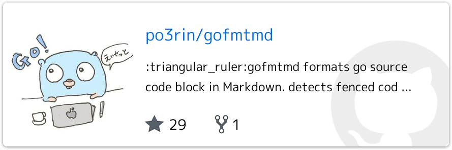
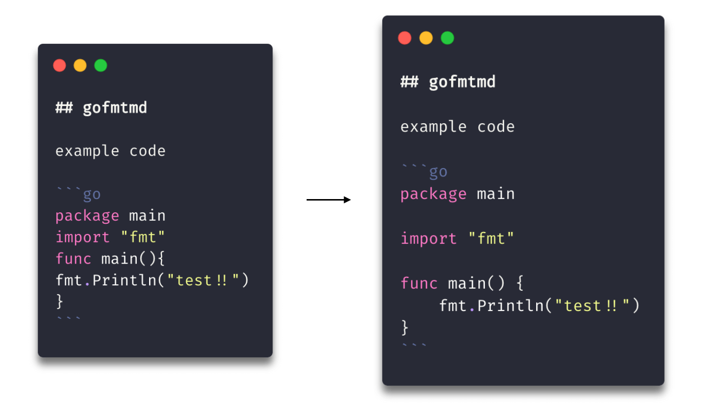

# アドベントカレンダーに向けてMarkdown に埋め込まれた Go のソースコードに gofmt をかけてくれるツールを作った


こんにちは pon です。みなさんアドベントカレンダーは参加しますか？僕も今年は Go や Rust、Elasticsearch のアドベントカレンダーに参加する予定です。

僕はQiitaの記事を書く際には手元でMarkdownファイルを作ってそこに下書きするのですが、gofmtをかけるのが正直面倒でした。もちろん、既存コードからコピペする分には良いかもしれませんが、記事向けにコードを修正したり補足を入れた時にgofmtがかかっていない状態になることがありました。

そこで来たるアドベントカレンダーに向けて Markdown に埋め込まれた Go のソースコードに gofmt をかけてくれるツールを作ったので、ツールの紹介と作り方を記事にしました。

## gofmtmd

作ったツールはこちら

<a href="https://github.com/po3rin/gofmtmd"></a>

Markdown に埋め込まれた Go のソースコードに gofmt をかけてくれるツールです。例えば下記のようにGoのコードブロックを検知してその中身だけにgofmtがかかります。



もちろんQiitaのようなMarkdownをサポートしているブログサービスだけでなく、```README.md``` を書く時なんかも便利かもしれません。

インストールはこちら

```bash
$ go get github.com/po3rin/gofmtmd/cmd/gofmtmd
```

使い方としてはなるべく gofmt に寄せるようにしました。```-r```をつけると引数で指定したファイルをそのまま上書きフォーマット。```-w```を使うと保存するファイルを指定できます。何もつけないとformatした結果が標準出力に流れます。

```bash
# replace Go code with formated code
$ gofmtmd testdata/testdata.md -r

# write result to file instead of stdout
$ gofmtmd testdata/testdata.md -w formatted.md
```

## Internal

### Markdown のASTを取得する

内部の実装を紹介します。主に使ったのはGo製の Markdown Parser である ```gopkg.in/russross/blackfriday.v2``` を使いました。

<a href="https://github.com/russross/blackfriday"></a>

これを使ってMarkdownのバイト列をASTに変換しています。

```go
func FmtGoCodeInMarkdown(md []byte) ([]byte, error) {
	// ...
	n := blackfriday.New(blackfriday.WithExtensions(blackfriday.FencedCode)).Parse(md)
	// ...
}
```

実は fenced block の記法は拡張機能としてのみサポートされているので引数にオプションとして ```blackfriday.WithExtensions(blackfriday.FencedCode)```を渡しています。これで fenced block として Parse してくれるようになります。


### ASTをWalkする

MarkdownのASTに対して何かしらの処理を帰納的に処理(トラバース)を実行するには。```Walk```という ```*blackfriday.Node``` から生えているメソッドを使います。```Walk```にノードごとに実行したい関数を渡してあげます。```Walk``` に渡せる関数は下記の型を持っています。

```go
type NodeVisitor func(node *Node, entering bool) WalkStatus
```

今回作ったツールでは```genFmtWalker```という自作関数を```Walk```に渡しています。MarkdownのASTをトラバースしていき、Goのコードブロックを見つけたらGoが標準で用意してくれているフォーマット用関数の```format.Source```に渡しています。

```go
func genFmtWalker(md *[]byte, fmterr *error) blackfriday.NodeVisitor {
	return func(node *blackfriday.Node, entering bool) blackfriday.WalkStatus {
		if isGoCodeBlock(node) {
			fmted, err := format.Source(node.Literal)
			if err != nil {
				*fmterr = err
				return blackfriday.Terminate
			}
			*md = bytes.ReplaceAll(
				*md,
				bytes.TrimRight(node.Literal, "\n"),
				bytes.TrimRight(fmted, "\n"),
			)
		}
		return blackfriday.GoToNext
	}
}

func isGoCodeBlock(node *blackfriday.Node) bool {
	return node.Type == blackfriday.CodeBlock && string(node.CodeBlockData.Info) == "go"
}
```

```genFmtWalker``` はクロージャになっており ```NodeVisitor``` の型を満たす関数を返しています。なぜこんな複雑な形になったかというと ```gopkg.in/russross/blackfriday.v2``` は Markdown の AST から Markdown に戻す機能がないからです。```genFmtWalker``` で Markdown のバイト列のポインタを受け取って、ポインタの指す先を ```Walk``` 内で Replace するようにしています。


```Walk``` はエラーを返さないためエラーも同様に処理しています。error があった場合は ```blackfriday.Terminate``` というステータスを返してトラバースを中断します。もっといい実装があるかも。。

ここまで紹介した関数を使って下記のように Markdown内のGoのコードをフォーマットした結果を返す関数が完成しました。主な実装はこれだけです。

```go
// FmtGoCodeInMarkdown formats go code in Markdown.
// returns error if code has syntax error.
func FmtGoCodeInMarkdown(md []byte) ([]byte, error) {
	var err error
	n := blackfriday.New(blackfriday.WithExtensions(blackfriday.FencedCode)).Parse(md)
	// Walk内でformatしていく為、元のMarkdwonのポインタを渡してあげる。
	n.Walk(genFmtWalker(&md, &err))
	if err != nil {
		return nil, err
	}
	return md, nil
}
```

これを main から読んであげれば Markdown に埋め込まれた Go のソースコードに gofmt をかけてくれる CLI の完成です。

## まとめ

Go の AST をトラバースする感覚で Markdown を扱えました。この要領で Markdown 内の Dockerfile のフォーマットなんかも実装できるかもしれません。何かバグがあったら教えてください！！

