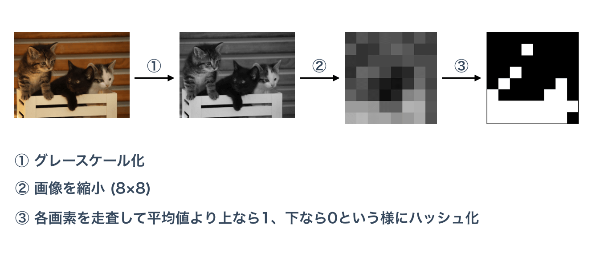
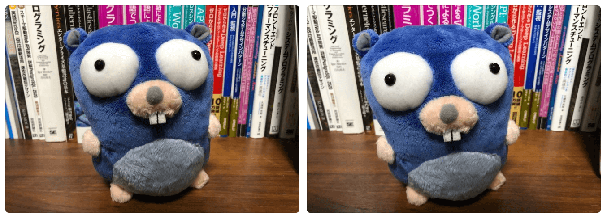

# Rust で実装する Average Hash を使った類似画像検索

こんにちは pon です。今日はRustで類似画像検知の実装方法を紹介します。
類似画像検知には様々な方法がありますが、今回は基礎的なアルゴリズムである Average Hash を使った類似画像判定を実装を紹介します。

実際に僕が作った個人サービスでも連写で取られた写真かどうかを判定する箇所で同じアルゴリズムが動いています。
筆者はRust初心者なのでもっと良い書き方や実装があれば教えてください！

## Average Hash とは

下記のような処理で画像をハッシュ化します。



上記のように画像を0と1だけの一次元配列に変換できれば、あとは0と1が一致している数が多いほど似ていると判断します。かなりシンプルなアルゴリズムですが、それなりに精度が出ます。連写で撮影された画像の判定なんかでは十分な精度が出ます。

下記の画像なんかは簡単に類似画像と判断できます。



## Rust で類似画像検索を実装する

それでは Rust による実装を紹介します。
まずは画像をグレイスケール化、リサイズする関数を作成します。

```rust
use image::{self, FilterType, GenericImageView};

// ...

fn process(
    img: image::DynamicImage,
    compressed_w: usize,
    compressed_h: usize,
) -> image::DynamicImage {
    img.resize_exact(
        compressed_w as u32,
        compressed_h as u32,
        FilterType::Lanczos3,
    )
    .grayscale()
}
```

```resize_exact```関数の定義通り基本的に ```image::DynamicImage``` で画像を引き回しています。```image::DynamicImage``` は様々な画像形式を enum として列挙する型になっています。

```rust
// in image/src/dynimage.rs

/// A Dynamic Image
#[derive(Clone)]
pub enum DynamicImage {
    /// Each pixel in this image is 8-bit Luma
    ImageLuma8(GrayImage),

    /// Each pixel in this image is 8-bit Luma with alpha
    ImageLumaA8(GrayAlphaImage),

    /// Each pixel in this image is 8-bit Rgb
    ImageRgb8(RgbImage),

    // etc ...

}
```

あとはこの関数を通した画像を使って Average hash を計算します。

```rust
pub fn get_hash(img: image::DynamicImage) -> usize {
    let mut sum_pixels: usize = 0;
    let mut pixels: Vec<usize> = Vec::new();

    // 各画素値と画素値の合計値を取得する
    for (_x, _y, pixel) in img.pixels() {
        // グレイスケールはrgba全部同じ値なのでとりあえずredの値を使うだけで良い
        let red = pixel[0];
        sum_pixels += red as usize;
        pixels.push(red as usize)
    }

    // dimensions() で画像の縦横のサイズが取得できます。
    let (width, height) = img.dimensions();

    // 画素値の平均値を取得
    let ave = (sum_pixels as f64) / (f64::from(width) * f64::from(height));

    let mut hash: usize = 0;
    let mut one: usize = 1;

    // Average hash の計算
    for pixel in pixels {
        if pixel as f64 > ave {
            hash |= one;
        }
        one <<= 1
    }
    hash
}
```

これで Average Hash を取得できます。あとは2つの Average hash の距離を計算します。

```rust
pub fn get_distance(hash1: usize, hash2: usize) -> usize {
    let mut d = 0;
    for i in 0..64 {
        let k = 1 << i;
        if (hash1 & k) != (hash2 & k) {
            d += 1
        }
    }
    d
}
```

これで準備ができました。２つの画像のAverage hashを計算して、その値から距離を計算して、閾値を使って類似画像と判断します。Average Hash の取得には２つの画像を使うのでマルチスレッドで行います。

```rust
use std::sync::mpsc;
use std::thread

// ...

pub fn is_similar(img1: image::DynamicImage, img2: image::DynamicImage) -> bool {
    let w = 10
    let h = 10
    let threshold = 8

    let (tx, rx) = mpsc::channel();
    let tx1 = mpsc::Sender::clone(&tx);

    thread::spawn(move || {
        let hash1 = get_hash(process(img1, w, h));
        tx1.send(hash1).unwrap();
    });

    thread::spawn(move || {
        let hash2 = get_hash(process(img2, w, h));
        tx.send(hash2).unwrap();
    });

    let mut v: Vec<usize> = Vec::new();
    for received in rx {
        v.push(received)
    }

    let distance = get_distance(v[0], v[1]);
    distance < threshold
}
```

これで完成です。```is_similar```関数を使ってみます。引数から画像を渡して類似画像か判断するmain関数を定義します。

```rust
use image;
use std::env;

fn main() {
    let args: Vec<String> = env::args().collect();
    if args.len() != 3 {
        eprintln!("arguments require only 2 path of image files");
    }

    let img_path1 = &args[1];
    let img_path2 = &args[2];

    let img1 = image::open(&img_path1).unwrap();
    let img2 = image::open(&img_path2).unwrap();

    println!("similar image: {}", is_similar(img1, img2))
}
```

実行してみます。今回はテスト用に僕がとった画像を使ってみます。


```rust
$ cargo run testdata/go1.jpg testdata/go2.jpg
similar image: true
```

類似画像であることが判定できています！！

## Crate を公開しています。

今回ご紹介した実装方法と同じ処理を Crate として公開しています。Crate版では Builder Pattern で関数や構造体などを使いやすくまとめています。CLI版もあるので是非試してみてください。

<a href="https://github.com/po3rin/simimgrs"></a>

## まとめ

Rustを趣味でちょこちょこし始めて半年くらいですが、もっと良い実装方法がある気がするので、アドバイスいただければ幸いです。
